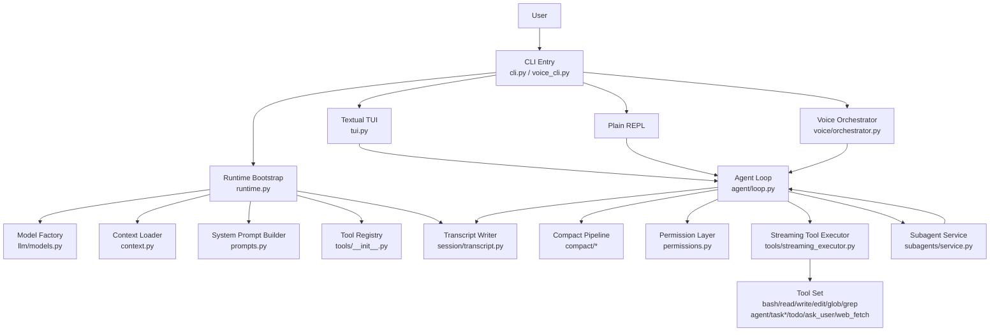
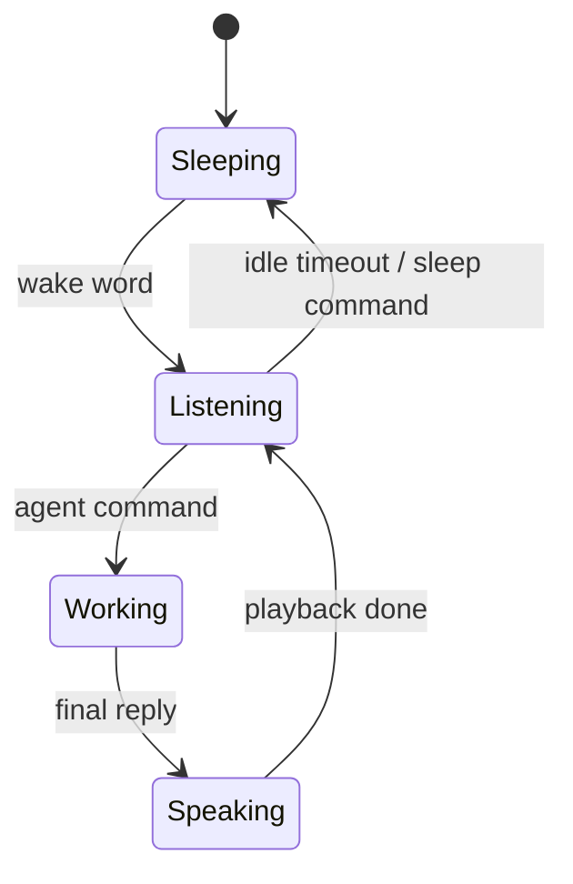
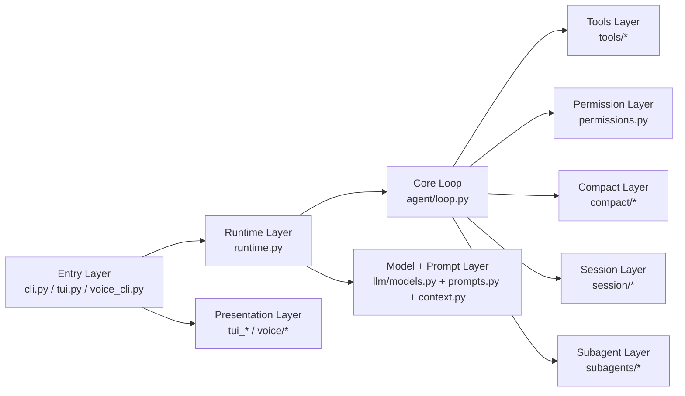

# Reasoning 项目总览与架构说明

更新时间：2026-06-29

## 1. 项目定位

`reasoning` 是一个面向软件工程任务的 `CLI Coding Agent` 项目。

它的核心目标不是做一个普通聊天机器人，而是做一个可以在本地工作目录中持续执行开发任务的代理系统，能够完成：

- 读取代码与项目结构
- 修改文件
- 执行命令
- 进行权限确认
- 持久化会话并恢复
- 在长任务中进行上下文压缩
- 提供 `TUI`、语音模式、子 Agent 等扩展能力

当前仓库中：

- `cc-haha/` 是参考实现，只读
- `new/` 是当前真实 Python 实现

一句话描述：

> 一个参考 `Claude Code / cc-haha` 思路、以 Python 重写并持续扩展的本地 Coding Agent。

## 2. 当前产品形态

当前主入口是：

- `cd new && uv run reasoning`

当前产品形态已经收敛为：

- 默认进入 `Textual TUI`
- `--plain` 回退到纯终端 REPL
- `reasoning-voice` 提供语音模式

也就是说，项目并不是“一个脚本 + 几个工具”的集合，而是一个围绕 `agent_loop` 构建的多入口本地代理产品。

## 3. 整体架构图



## 4. 一次请求的主执行链路

### 4.1 标准链路

```mermaid
sequenceDiagram
    participant User
    participant Entry as CLI/TUI
    participant Runtime as bootstrap_runtime
    participant Loop as agent_loop
    participant Model as LLM
    participant Perm as permissions
    participant Exec as tool executor
    participant Transcript as transcript

    User->>Entry: 输入任务
    Entry->>Runtime: 初始化 model / tools / prompt / session
    Runtime-->>Entry: RuntimeBootstrap
    Entry->>Loop: user_input + runtime resources
    Loop->>Transcript: 写入 system/user/history
    Loop->>Loop: micro compact / snip / collapse / auto compact
    Loop->>Model: 流式调用 LLM
    Model-->>Loop: text / reasoning / tool_calls
    Loop->>Transcript: 写入 AIMessage
    alt 有工具调用
        Loop->>Perm: 判断是否允许执行
        Perm-->>Loop: allow / ask / deny
        Loop->>Exec: 执行工具
        Exec-->>Loop: ToolResult events
        Loop->>Transcript: 写入 ToolMessage
        Loop->>Model: 带 tool 结果继续推理
    else 无工具调用
        Loop-->>Entry: finish
    end
    Entry-->>User: 文本 / 状态 / 工具结果
```

### 4.2 设计要点

- 入口层不直接持有复杂业务逻辑，主要负责交互与展示。
- `runtime.py` 负责一次性准备共享运行时资源。
- `agent_loop()` 是绝对核心，负责单 agent 的完整消息循环。
- 工具调用、权限审批、compact、fallback、resume 都围绕 `agent_loop()` 组织。
- `subagents` 没有侵入主入口，而是作为 `agent_loop()` 内可激活的扩展能力存在。

## 5. 顶层目录与职责

### 5.1 仓库级目录

| 目录 | 作用 |
|---|---|
| `cc-haha/` | 参考实现与对照材料，不作为当前主代码修改目标 |
| `docs/` | 架构、spec、项目记忆、历史分析文档 |
| `new/` | 当前真实 Python 实现 |
| `agent-skills/` | 项目内 vendored skills 集合 |

### 5.2 Python 主代码目录

`new/src/reasoning_agent/` 下当前可以理解为 10 个主要模块群：

| 模块 | 作用 |
|---|---|
| `cli.py` / `voice_cli.py` | 产品入口 |
| `runtime.py` | 共享运行时装配 |
| `agent/` | 单 agent 消息循环与事件模型 |
| `tools/` | 工具注册、工具实现与流式工具执行 |
| `permissions.py` | 权限判断与审批接口 |
| `compact/` | 长上下文压缩与恢复 |
| `session/` | transcript 持久化、会话恢复、session 管理 |
| `tui*.py` | `Textual` 交互界面与 transcript 风格渲染 |
| `voice/` | 语音状态机、STT/TTS/唤醒/命令助手 |
| `subagents/` | 子 Agent 调度、任务注册、通知与独立 transcript |

## 6. 核心模块设计

### 6.1 入口层：`cli.py` / `voice_cli.py`

职责：

- 解析参数
- 判断进入 `TUI`、纯终端或语音模式
- 创建中断控制
- 接入 slash commands
- 把运行资源交给 `agent_loop()`

为什么这样设计：

- 把产品入口和 agent 核心执行解耦，便于同一个核心引擎服务多个前端形态。
- `plain REPL`、`TUI`、`voice` 共享同一套核心运行时，避免分叉实现。

当前特点：

- `TUI` 已成为默认交互形态
- `--plain` 是兼容和调试入口

### 6.2 运行时装配层：`runtime.py`

职责：

- 初始化主模型与 fallback 模型
- 注册全工具集
- 读取工作目录上下文
- 组装 system prompt
- 创建 session id 与 transcript writer

为什么单独抽层：

- `CLI` 和 `TUI` 都需要同一份启动资源
- 减少入口层重复代码
- 让 session、model、prompt、tools 的依赖关系集中可见

这层本质上是：

> “把一次会话运行所需的公共依赖准备好，再交给具体交互层和 agent 引擎。”

### 6.3 Agent 核心：`agent/`

关键文件：

- `agent/loop.py`
- `agent/types.py`
- `agent/abort.py`
- `agent/error_recovery.py`

职责：

- 维护单 agent 的 while 循环
- 流式调用模型并转成 `AgentEvent`
- 把 `tool_calls` 变成可执行计划
- 处理权限、工具执行、模型 fallback、超长输出恢复
- 在消息历史中追加 `AIMessage / ToolMessage`
- 在无工具调用时产出最终完成事件

设计原则：

- `agent_loop()` 只做“单 agent 执行器”
- 不直接承担 TUI 展示、语音状态机、子任务列表等产品层职责
- 上层通过事件消费它，下层通过工具系统扩展它

这是整个项目最核心的执行内核。

### 6.4 模型与提示词层：`llm/` + `prompts.py` + `context.py`

#### `llm/models.py`

职责：

- 从 `.env` 与 `models.toml` 解析 profile
- 初始化 `ChatOpenAI`
- 支持 fallback profile

设计价值：

- 把“模型选择”从业务执行中抽离
- 后续替换 provider 或新增 profile 时，不需要重写主循环

#### `context.py`

职责：

- 读取 `CLAUDE.md` / `.claude/CLAUDE.md` / `CLAUDE.local.md`
- 生成当前仓库的 `git status` 快照
- 补充当前日期等上下文

设计价值：

- 让 agent 在启动时获得工作目录规则与代码仓库状态
- 保持“面向当前项目”的行为，而不是通用聊天

#### `prompts.py`

职责：

- 组装静态行为规则
- 注入工具说明
- 注入环境信息、目录、日期、项目规则、git 状态

设计价值：

- 将“产品行为规范”统一放到 prompt builder，而不是分散在入口或工具中
- 便于后续系统提示词调优

### 6.5 工具系统：`tools/`

当前工具注册中心在 `tools/__init__.py`。

当前主工具集包括：

- `agent`
- `bash`
- `read`
- `write`
- `edit`
- `glob`
- `grep`
- `task_list`
- `task_get`
- `task_stop`
- `todo_write`
- `ask_user_question`
- `web_fetch`

设计方式：

- 工具统一注册
- 通过名字查找工具
- 每个工具以独立文件维护
- `StreamingToolExecutor` 负责同一轮工具的串并行执行

为什么这样设计：

- 工具是 Agent 的能力边界，必须显式、可枚举、可控
- 注册中心让 prompt 注入、权限判断、执行调度有统一入口
- 单工具单文件便于独立扩展和测试

### 6.6 权限系统：`permissions.py`

权限设计已经从“判断 + 交互揉在一起”开始收敛为两层：

1. 判断层：`evaluate_tool_permission`
2. 审批层：`PermissionApprover`

核心能力：

- 只读工具自动放行
- 破坏性操作要求审批
- `bash` 危险命令黑名单
- 支持 `default / acceptEdits / bypassPermissions / dontAsk`
- 支持会话白名单记忆

为什么这样设计：

- 同一个权限判断逻辑需要同时服务纯终端与 TUI
- 把“是否该问”与“怎么问”拆开，后续才能接入 TUI 弹窗、父子 agent 冒泡等能力

这是项目安全边界的重要一层。

### 6.7 会话与 transcript：`session/`

关键文件：

- `session/transcript.py`
- `session/manager.py`
- `commands.py`

职责：

- 把消息持久化为 JSONL transcript
- 从 transcript 恢复 `System/Human/AI/ToolMessage`
- 生成 session id
- 列出历史会话
- 支持 `/resume`

为什么采用 JSONL：

- 追加写简单
- 可逐条恢复消息
- 对 `resume`、审计、问题复盘都友好

这层解决的是：

> 会话不能只存在内存里，Agent 必须可恢复、可追踪、可审计。

### 6.8 长上下文能力：`compact/`

当前 compact 管线包括：

- `micro compact`
- `snip compact`
- `collapse old turns`
- `auto compact`
- `reactive compact`

在主循环中的定位：

- 每轮 LLM 调用前先做轻量压缩
- 接近 token 阈值时自动压缩
- 真正发生上下文溢出时做 reactive compact 再重试

为什么单独做模块层：

- 长任务是 Coding Agent 的核心痛点
- compact 不是 UI 功能，也不应散落在 prompt 代码里
- 独立模块便于持续迭代不同压缩策略

这一层本质上是在解决：

> “如何让 Agent 在多轮、长任务里还能继续稳定工作。”

### 6.9 TUI 交互层：`tui.py` 与 `tui_*`

职责：

- 提供默认交互界面
- 把 `AgentEvent` 转为 transcript 风格的可视化块
- 显示 text / reasoning / tool / status / task 信息
- 处理复制、折叠、权限弹窗、session resume 后重建

当前设计趋势：

- `tui.py` 正在持续拆分
- 权限、query event、runtime 展示、message tree 等已开始独立成模块

为什么这一层重要：

- 项目目标不是只“能跑通”，还要“可日常使用”
- 终端 UI 的可理解性，直接影响 Coding Agent 的可控性和用户信任

### 6.10 语音层：`voice/`

当前核心是 `voice/orchestrator.py`，它本质上是一个状态机。

当前主要状态流转：



关键职责：

- 协调唤醒词、录音分段、STT、命令分类、Agent、TTS
- 保持控制命令快路径
- 在语音模式中继续复用主 Agent 能力

当前设计方向：

- 向“三层编排”演进
- 区分命令助手、编程助手、摘要助手
- 保留本地控制命令 fast path

这层不是另起一套 agent，而是：

> 为同一核心 Coding Agent 增加语音入口和语音编排能力。

### 6.11 子 Agent 系统：`subagents/`

职责：

- 提供 `agent` 工具委派入口
- 创建 fresh / background / parallel 子任务
- 为子任务分配独立 transcript
- 维护 task registry
- 把子任务完成通知回灌到父会话

当前设计关键点：

- `agent_loop()` 继续只做单 agent 执行
- `SubagentService` 负责任务调度
- `SubagentRuntime` 负责包装子任务运行
- 子 agent 被视为“长生命周期 task”，而不是一个普通工具结果

为什么这样设计：

- 复杂任务需要并行和角色分工
- 但并发能力不能污染主会话 transcript
- 所以子 agent 要有独立 task 与独立 transcript

## 7. 模块关系图



可以把当前项目理解成 5 层：

1. 入口与展示层
2. 运行时装配层
3. 单 Agent 核心执行层
4. 能力扩展层（tools / compact / permissions / session / subagents）
5. 模型与上下文基础层

## 8. 当前最重要的设计判断

### 8.1 项目的“心脏”是 `agent_loop()`

后续做项目讲解、准备面试、继续改架构时，都应该抓住这个判断：

- `cli.py` 不是核心
- `tui.py` 不是核心
- `voice/` 不是核心
- 真正的核心是 `agent_loop()` 如何把：
  - 消息历史
  - 模型调用
  - tool calls
  - 权限审批
  - transcript
  - compact
  串成一个可持续运行的闭环

### 8.2 项目的产品价值来自“可持续执行”，不是“能回答问题”

这个项目和普通聊天系统的区别在于：

- 有工具
- 有权限边界
- 有会话恢复
- 有长上下文治理
- 有并行子任务
- 有多入口交互

所以它的叙事重点应该是：

> 如何把大模型包装成一个可落地、可控制、可恢复、可扩展的本地开发代理系统。

### 8.3 当前代码已经不是早期草案，需要用“产品架构”视角理解

旧的 `python-architecture.md` 更像早期设计草案。

现在真实代码已经明显演进为：

- 共享 runtime
- 手写 agent_loop
- transcript/session 系统
- compact 管线
- TUI transcript 渲染
- voice orchestration
- subagent task system

因此后续项目文档、简历描述、面试表达，都应以当前真实实现为准，而不是早期草图。

## 9. 推荐阅读顺序

如果要快速吃透项目，建议按下面顺序看：

1. 本文档：建立整体心智模型
2. `docs/project-memory.md`：了解当前状态与边界
3. `new/src/reasoning_agent/cli.py`：看入口
4. `new/src/reasoning_agent/runtime.py`：看运行时装配
5. `new/src/reasoning_agent/agent/loop.py`：看主执行链路
6. `new/src/reasoning_agent/tools/__init__.py` + 关键工具：看能力边界
7. `new/src/reasoning_agent/permissions.py`：看安全边界
8. `new/src/reasoning_agent/session/transcript.py`：看会话恢复
9. `new/src/reasoning_agent/tui.py`：看默认产品形态
10. `new/src/reasoning_agent/voice/orchestrator.py` 与 `subagents/service.py`：看扩展能力

## 10. 后续文档建议

如果要继续把项目文档做完整，建议下一步新增三类文档：

1. `项目面试讲解稿`
   - 面向秋招 / Agent 岗项目介绍
2. `核心模块深挖`
   - 分别讲 `agent_loop / compact / permissions / subagents`
3. `架构演进记录`
   - 记录哪些能力来自参考实现，哪些是本项目自己的改造

这样后面无论是改简历、准备面试还是继续开发，都会更顺。
